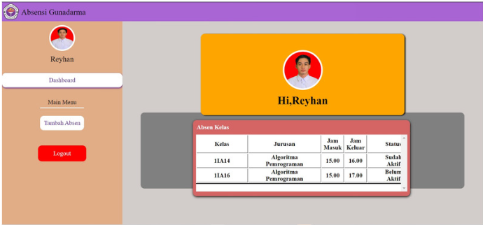
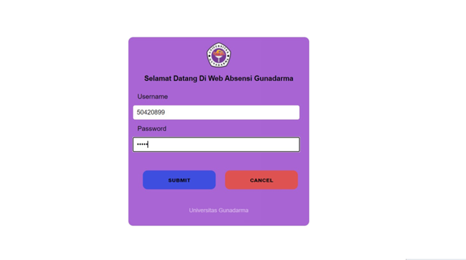
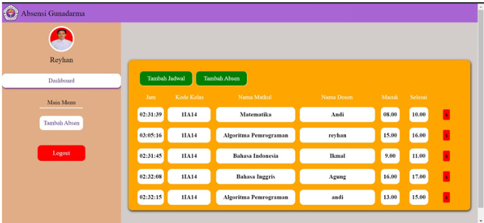

# Website_Student_Attend

# Form Login

# Menu Utama

# Tabel Absensi

# Fitur-Fitur yang ada pada Website :
  * Login sebagai mahasiswa atau sebagai dosen
  * Tambah matakuliah untuk absensi
  * Menambahkan jadwal pembelajaran matakuliah
  * Menampilkan jadwal absen pembelajaran (Lecturer View)
  * Menghapus jadwal absen pembelajaran (Lecutrer View)
  * Mengisi data hadir jadwal pembelajran (Student View)
  
